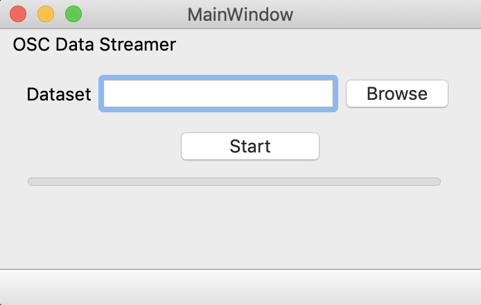

# Brainwave Virtual Instrument

The Brainwave Virtual Instrument (BVI) is an open-source software synthesizer built in the programming language Faust. Its purpose is to facilitate the exploration of electroencephalogram (EEG) and other brain data through sonification. Pre-recorded data is translated as parameter controls of the instrument in the form of Open Source Control (OSC) messages that are generated and streamed by a small python program. The instrument can easily be distributed and compiled to different targets thanks to Faust’s flexibility. Frequency Modulation synthesis provides a comprehensive approach to textural parameters of sounds, so that musical composition and improvisation based on a creative use of brain data become feasible. This is exemplified by the Brainwave Etudes (BE), a series of compositions inspired by measurements of brain activity during different states of mind. The BVI was created for two major purposes: on the one hand, to find musical structures that relate to each other in order to present an aesthetic proposal, and on the other, to create a tool that familiarizes scientists and researchers in the field of neuroscience with sonification techniques, and the exploration of brain activity through sound.

## Sound Examples AKA Brainwave Etudes:

https://soundcloud.com/nicodaleman/sets/brainwave-etudes

## How To:

- Clone the respository
- Compile the .dsp file to your prefered target
- Run the oschub.py file from the terminal
  - choose your .csv file
  - press start

